# System design

Solid boxes and arrows are implemented; dashed ones are planned or reserved.
See the [README](../README.md#architecture) for the reasoning behind the split
between the STM32 and the Raspberry Pi.

```mermaid
flowchart LR

%% ───────────────────────── Board hardware ─────────────────────────
subgraph group_hw["Board Hardware"]
  direction TB
  node_mpu[("MPU9250<br/>accel + gyro<br/>+ AK8963 mag")]
  node_analog["Pot + Joystick<br/>PA1 / PA2 / PA3"]
  node_leds["LEDs"]
  node_escs["ESCs + Motors<br/>(not yet wired)"]
end

%% ───────────────────────── STM32 firmware ─────────────────────────
subgraph group_fw["STM32F401 Firmware · 84 MHz · the only flight-critical path"]
  direction TB

  subgraph group_loop["100 Hz control loop · main.c"]
    direction TB
    node_flight_loop["Scheduler<br/>signed-diff timing, overrun flag"]
    node_est_c["Attitude estimator<br/>(C port of attitude.py)"]
    node_pid["PID + motor mixer"]
  end

  node_timebase["µs Timebase · TIM5 1 MHz<br/>[timebase.c]"]
  node_imu_driver["IMU driver<br/>gyro cal · mag axis remap<br/>[imu.c]"]
  node_i2c["I2C1 · 400 kHz<br/>PB6 / PB7 [i2c.c]"]
  node_adc["ADC1 + DMA2 Stream 0<br/>[adc.c, dma.c]"]
  node_pwm_led["TIM2 (3 ch, 21 kHz)<br/>TIM4 (1 ch, 42 kHz)<br/>[tim.c]"]
  node_pwm_esc["TIM3 · 4 ch<br/>PA6 / PA7 / PB0 / PB1<br/>(reserved)"]
  node_telemetry["Telemetry ring buffer<br/>non-blocking, all-or-nothing<br/>[telemetry.c]"]
  node_uart["USART1 TX · DMA2 Stream 7<br/>PA9 [telemetry.c + usart.c]"]
end

%% ───────────────────────── The seam ─────────────────────────
node_link{{"USART1 → USB-UART · 460800 baud<br/>I,t_us,ax,ay,az,gx,gy,gz,mx,my,mz,flags<br/>m/s² · deg/s · µT"}}

%% ───────────────────────── Host tooling ─────────────────────────
subgraph group_host["Host / Raspberry Pi · rpi_scripts/ (outside the flight loop)"]
  direction TB

  node_recorder["Log recorder<br/>[record_log.py]"]
  node_logfile[("flight.log<br/>wire format, verbatim")]

  subgraph group_sources["Sample sources → Iterator[ImuSample] · droneviz/sources.py"]
    direction TB
    node_src_serial["iter_serial"]
    node_src_log["iter_log"]
    node_src_sim["iter_sim"]
  end
  node_simulator["Simulator<br/>ground-truth trajectory → derived sensors<br/>[simulate.py]"]

  node_publisher["Publisher CLI<br/>--source sim | log | serial<br/>[publish_imu.py]"]
  node_codec["Wire codec + ZeroMQ PUB/SUB<br/>parse_line · format_line · ImuSample<br/>[telemetry.py]"]
  node_zmq(["ZeroMQ · tcp://127.0.0.1:5555"])
  node_visualizer["3D attitude visualizer<br/>+ ground-truth ghost<br/>[visualize_attitude.py]"]
  node_attitude["Complementary filter<br/>reference impl, numpy only<br/>[attitude.py]"]

  subgraph group_tests["pytest · tests/"]
    direction TB
    node_test_att["test_attitude.py<br/>bounded error vs. truth"]
    node_test_wire["test_wire_contract.py<br/>C ↔ Python drift check"]
  end
end

subgraph group_planned["Planned on the Pi"]
  direction TB
  node_nav_cv["Navigation / CV"]
  node_setpoints["Setpoint uplink"]
end

node_operator(("Operator"))

%% ─── Firmware data path ───
node_mpu <-->|"I²C regs"| node_i2c
node_i2c --> node_imu_driver
node_imu_driver -->|"IMU_ReadAll → MPU9250_Data"| node_flight_loop
node_timebase -->|"Timebase_Micros() → t_us"| node_flight_loop
node_flight_loop -->|"Telemetry_SendImu (memcpy)"| node_telemetry
node_telemetry -->|"Telemetry_Service drains"| node_uart
node_uart --> node_link
node_analog --> node_adc
node_adc -.->|"vals[3], not yet consumed"| node_flight_loop
node_flight_loop -->|"PWM start at boot"| node_pwm_led
node_pwm_led --> node_leds

%% ─── Planned closed loop ───
node_flight_loop -.-> node_est_c
node_est_c -.->|"roll / pitch / yaw"| node_pid
node_pid -.-> node_pwm_esc
node_pwm_esc -.-> node_escs

%% ─── Host data path ───
node_link -->|"serial"| node_recorder
node_link -->|"serial"| node_src_serial
node_recorder --> node_logfile
node_logfile --> node_src_log
node_simulator -->|"samples + truth"| node_src_sim
node_src_serial & node_src_log & node_src_sim --> node_publisher
node_publisher -->|"Publisher.send"| node_codec
node_codec -->|"PUB"| node_zmq
node_zmq -->|"SUB"| node_visualizer
node_visualizer -->|"update(sample, dt)"| node_attitude

%% ─── Validation and porting ───
node_simulator -.->|"truth"| node_test_att
node_attitude -.-> node_test_att
node_test_wire -.->|"reads source"| node_telemetry
node_test_wire -.->|"compares"| node_codec
node_attitude ==>|"validated, then ported to C"| node_est_c

%% ─── Operator and planned control ───
node_operator -->|"runs"| node_publisher
node_operator -->|"runs"| node_recorder
node_operator -.->|"commands"| node_setpoints
node_nav_cv -.-> node_setpoints
node_setpoints -.->|"USART1 RX (no uplink yet)"| node_flight_loop

%% ─── Styling ───
classDef toneNeutral fill:#f8fafc,stroke:#334155,stroke-width:1.5px,color:#0f172a
classDef toneBlue fill:#dbeafe,stroke:#2563eb,stroke-width:1.5px,color:#172554
classDef toneAmber fill:#fef3c7,stroke:#d97706,stroke-width:1.5px,color:#78350f
classDef toneMint fill:#dcfce7,stroke:#16a34a,stroke-width:1.5px,color:#14532d
classDef toneRose fill:#ffe4e6,stroke:#e11d48,stroke-width:1.5px,color:#881337
classDef toneIndigo fill:#e0e7ff,stroke:#4f46e5,stroke-width:1.5px,color:#312e81
classDef toneTeal fill:#ccfbf1,stroke:#0f766e,stroke-width:1.5px,color:#134e4a
classDef planned fill:#f8fafc,stroke:#64748b,stroke-width:1.5px,stroke-dasharray:5 4,color:#475569

class node_flight_loop,node_timebase,node_imu_driver,node_i2c,node_adc,node_pwm_led,node_telemetry,node_uart toneBlue
class node_recorder,node_logfile,node_src_serial,node_src_log,node_src_sim,node_simulator,node_publisher,node_codec,node_zmq,node_visualizer,node_attitude toneAmber
class node_test_att,node_test_wire toneTeal
class node_link toneRose
class node_mpu,node_analog,node_leds,node_operator toneIndigo
class node_est_c,node_pid,node_pwm_esc,node_escs,node_nav_cv,node_setpoints planned
```

